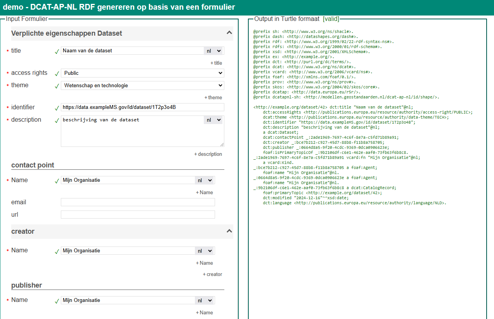

# DCAT-AP-NL 3.0

## [demoformulier om metadata aan te maken in RDF conform het DCAT-AP-NL 3.0 profiel](./dcat-ap-nl-shacl-form/index.html)

Deze demo maakt gebruik van [shacl-form](https://github.com/ULB-Darmstadt/shacl-form).

shacl-form is een HTML5 web component om een formulier te genereren op basis van een shacl shape. De output van het formulier wordt vervolgens ook als RDF gegenereerd.

Verplichte eigenschappen worden getoond met een rode asterix. Zolang nog niet alle verplichte eigenschappen ingevuld zijn wordt de RDF dataset in het rood getoond.
Als alle verplichte eigenschappen zijn ingevuld veranderd de kleur naar groen.
